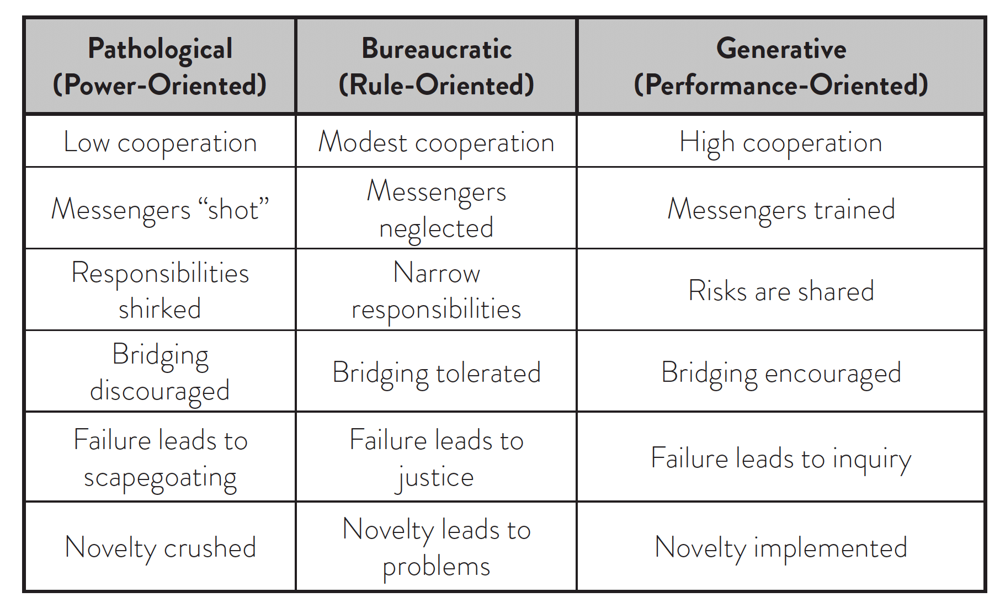

# DevOpsDays 2024

## Day 1

### Swim, don't sink: SRE Training

- Learning is about "believe in yourself"
- Westrum organisational culture: Generative culture performance oriented

- Changing the way people work changes culture. Don't try to make people think different.

  - It's easier to act your way into a new way of thinking.

- Learning -> Confidence -> Behavior -> Culture

- Benchmarking culture through surveys

  - Rate your ability:
    - Explain benefits of PM
    - Measure alignment with business goals
    - ...
  - Rating
    - No idea where to start
    - Could do it with someones help
    - Could read docs and figure out
    - Could do it mostly from memory
    - Could teach others mostly from memory
  - Survey points
    - 4x in 6 months
    - pre orientation, post orientation, 1m, 6m
  - Analyze & compare
    - ongoing vs onboarding orientation
  - NLS: net learning score
    - like NPS
    - subtract 2 bottom, add 2 upper, range -1 to 1

- Confidence boosting training program
  - spectrum of training programs from low to high effort:
    - sink or swim
    - self-study curriculum
    - buddy system
    - ad hoc classes
    - systematic training program
  - higher touch signals:
    - leadership commitment
    - everyone speaking with one voice
    - help imbibe the desired culture
    - reinforce desired behaviors
  - what should I teach
    - training dimensions:
      - maturity
      - familiarity
      - experience
    - low maturity case:
      - step 1: address any skill gaps
      - step 2: know your team & tailor the message
        - resistant: low experience but high familiarity
        - receptive: lowe experience & low familiarity
        - empower the catalysts to tell their success stories
- Consideration for how much to invest into training program:
  - org size
  - how fast are we growing
  - quadrants:
    - low low: buddy system
    - low high: shadowing / mentoring
    - low high: onboarding program
    - high high: full-lifecycle training program
- ASSBAT: A student should be able to
  - Forming Learing objectives
  - possible assbats:
    - Use $tool to identify memory use
    - Interpret a graph in $tool to identify $bla
    - Move traffic away from a cluster using $tool
  - ADDIE:
    - analyze needs
    - design based on assbats
    - develop training content
    - implement the program
    - evaluate effectiveness
- Learnings:
  - do just enough to meet the needs of students
  - keep them happy, but not too happy
  - consider trade-offs and avoid polishing a diamond
  - move away from passive listening
  - troubleshoot real system, built for this purpose
  - facilitator backs off more and more
  - group of three students, least experienced in the middle, driving
  - instill confidence
- Takeaways
  - Training is an investment
  - evaluate the cost and benefits
  - where to invest -> depends on what and how of our org
  - walk the talk -> apply taught principles itself to the program
- Confidence is what revs the culture engine

- DevOps report: dora.dev/reports

## Estimating ROI on Security

- Risk
- `impact * probability = expected value`

- non-severe incidents can increase brand value
- severe incidents have 5-9% loss

- www.enforcementtracker.com

Takeaway: Security is everyone's concern

## Change is impossible

- Awareness & Accountability is all you need? Change will start to happen
- Find the right people to talk to, visualize data in novel ways.

## Collapsing Clouds of Dust

- Next version of big ball of mud
- Larman's Law of organisational behavior
  - Change is used to redefine the status quo

## Ignites

- Platform Engineering https://learn.microsoft.com/en-us/platform-engineering/overview/
- Roadmaps should not include dates
- Mentoring
  - Let me quickly show you ... let them do it
  - You just need to ... explain why, what are the tradeoffs
  - Don't overoptimize
  - Have you checked the docs?
  - https://tuple.app/pair-programming-guide/how-to-pair-with-a-junior-developer
- MLOps: https://www.oreilly.com/library/view/practical-mlops/9781098103002/
